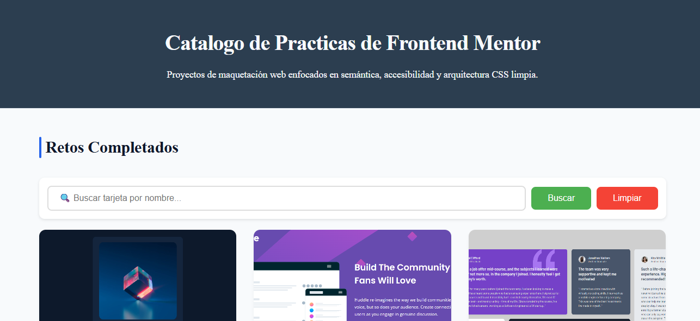

# 🚀 Frontend Mentor - Mini Projects


> Una colección de mini proyectos desarrollados como práctica y mejora de habilidades en **HTML, CSS y JavaScript**, basados en los desafíos de [Frontend Mentor](https://www.frontendmentor.io/).

---

## 📋 Tabla de Contenidos

- [Sobre el Proyecto](#sobre-el-proyecto)
- [Niveles de Dificultad](#niveles-de-dificultad)
- [Proyectos Incluidos](#proyectos-incluidos)
- [Tecnologías Utilizadas](#tecnologías-utilizadas)
- [Cómo Usar Este Repositorio](#cómo-usar-este-repositorio)
- [Estructura del Proyecto](#estructura-del-proyecto)
- [Roadmap de Aprendizaje](#roadmap-de-aprendizaje)
- [Autor](#autor)
- [Agradecimientos](#agradecimientos)

---

## 🎯 Sobre el Proyecto

Este repositorio contiene una serie de **mini proyectos** diseñados para practicar y consolidar conocimientos en desarrollo frontend. Cada proyecto está basado en un desafío real de Frontend Mentor, abarcando desde niveles **Newbie** hasta **Advanced**.


## Link del Demo :
[Demo](https://david-vb03.github.io/My_Practices_portfolio/)  🚀🚀



### 🎨 Objetivos

- ✅ Mejorar habilidades en **HTML semántico**
- ✅ Perfeccionar **CSS** (Flexbox, Grid, Animaciones, Responsive Design)
- ✅ Fortalecer lógica de programación con **JavaScript**
- ✅ Aprender a estructurar proyectos de forma profesional
- ✅ Practicar **control de versiones con Git**

---

## 📊 Niveles de Dificultad

| Nivel | Descripción | Proyectos |
|-------|-------------|-----------|
| 🟢 **Newbie** | Proyectos básicos para practicar HTML y CSS | 9 |
| 🟡 **Junior** | Incorporación de JavaScript y lógica simple | 4 |
| 🟠 **Intermediate** | Proyectos más complejos con interactividad | 3 |
| 🔴 **Advanced** | Desafíos completos con APIs y lógica avanzada | 2 |

---

## 🛠️ Tecnologías Utilizadas

| Tecnología | Uso |
|------------|-----|
|  | Estructura y contenido semántico |
|  | Estilos, diseño responsive y animaciones |
|  | Interactividad, lógica y manipulación del DOM |
|  | Control de versiones |
|  | Editor de código |

---

## 🚀 Cómo Usar Este Repositorio

### Clonar el repositorio

```bash
git clone https://github.com/David-VB03/My_Practices_portfolio.git
cd frontend-mentor-projects